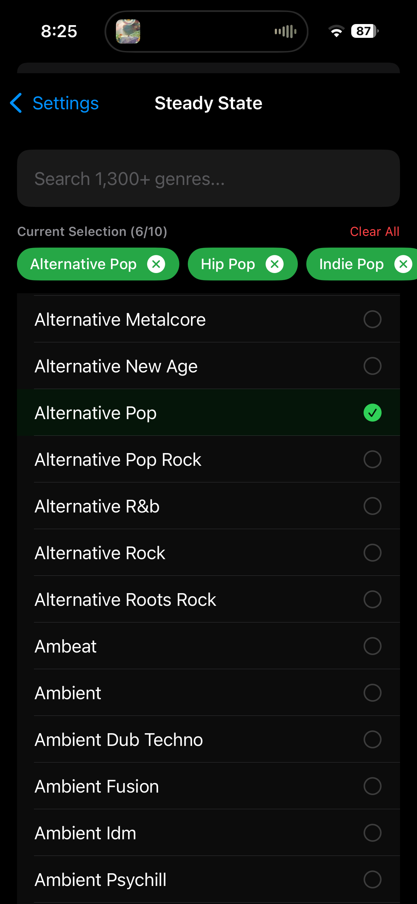

# Cue

**[Video Demo](https://drive.google.com/file/d/17XO_YXlk3O7S637Dr1lXOM-zoylJqasF/view?usp=sharing)**

Cue is an iOS application that automatically curates music recommendations based on your real-time heart rate during workouts. The app connects to heart rate monitors (Bluetooth LE devices or Apple Watch via HealthKit) and uses your current heart rate zone to intelligently queue songs from Spotify that match your workout intensity.

## Overview

The core concept is simple: different workout intensities require different types of music. When you're in a steady-state zone (zones 2-3), you might want more moderate tempo tracks. During threshold training (zones 4-5), you need high-energy music that matches your elevated heart rate. Cue automatically detects which zone you're in and queues appropriate tracks without any manual intervention.

## How It Works

### Heart Rate Monitoring

The app supports two methods of heart rate input:

1. **Bluetooth LE Devices**: Connects to standard heart rate monitors that broadcast the Heart Rate Service (UUID 180D). The app continuously scans for available devices and maintains a list of discovered monitors.

2. **Apple Watch via HealthKit**: If you have an Apple Watch, the app can read heart rate data directly from HealthKit, providing seamless integration with your existing fitness tracking.

Heart rate zones are calculated based on your maximum heart rate (configurable in settings):
- Zone 0: < 50% max HR
- Zone 1: 50-60% max HR
- Zone 2: 60-70% max HR (Steady State)
- Zone 3: 70-80% max HR (Steady State)
- Zone 4: 80-90% max HR (Threshold)
- Zone 5: 90-100% max HR (Threshold)

### Music Recommendation System

The recommendation engine uses a **Spotify-first approach** with Cyanite AI as a fallback, prioritizing familiar and popular tracks while maintaining audio similarity matching.

#### Recommendation Flow Pipeline

**Step 1: Zone Detection & Genre Selection**
- The app detects your current heart rate zone (2-5)
- Zones 2-3 (Steady State): Uses your configured steady-state genres
- Zones 4-5 (Threshold): Uses your configured threshold genres
- Calculates target BPM range based on current heart rate and zone

**Step 2: Spotify Search (Primary Path)**
- **Combined Genre Search**: Combines all selected genres into a single keyword search query
  - Example: "Electronic" + "Drum And Bass" → searches for "electronic drum and bass"
- **Playlist Discovery**: Uses Spotify's Search API (`GET /v1/search`) to find playlists matching the combined genre keywords
- **Quality Filtering**: Filters playlists through multiple layers:
  1. **Null Item Filtering**: Removes null items (deleted/restricted playlists that Spotify returns as null)
  2. **Track Count Filter**: Requires minimum 20 tracks per playlist
  3. **Podcast Exclusion**: Filters out podcasts and episodes
  4. **Negative Intent Filter**: Blocks playlists containing banned keywords:
     - Holidays: christmas, holiday, xmas, noel, santa, snow, winter, halloween, easter, valentine
     - Relaxation: sleep, chill, ambient, relax, meditation, study
     - Other: soundtrack, ost, kids, family, love songs, romance

**Step 3: Multi-Playlist Retry Logic**
- Randomly selects a playlist from filtered results
- Fetches tracks from the playlist
- Filters out duplicate tracks (checks session history, current track, queue, recently played)
- If no valid track found, tries the next playlist
- Continues until a valid track is found or all playlists are exhausted

**Step 4: Cyanite Fallback (Secondary Path)**
- Only triggered if Spotify search fails completely:
  - No playlists found via search, OR
  - All playlists exhausted with no valid tracks
- Uses Cyanite AI for audio similarity matching:
  - Analyzes current track's audio characteristics
  - Finds similar tracks based on BPM range and genre preferences
  - Returns multiple candidate tracks for selection

**Step 5: Track Selection & Queueing**
- Selects a random track from valid candidates
- Adds to Spotify queue automatically
- Updates session history to prevent duplicates
- Logs the entire process for debugging

#### Key Features

- **Spotify-First Priority**: Always attempts Spotify search before falling back to Cyanite
- **No Double Recommendations**: If Spotify succeeds, Cyanite is never called
- **Robust Filtering**: Multiple layers ensure high-quality, relevant playlists
- **Duplicate Prevention**: Checks session history, current track, queue, and recently played tracks
- **Comprehensive Logging**: Full pipeline logging for debugging and monitoring

### User Preferences

During onboarding, users configure:
- Maximum heart rate (used for zone calculations)
- Genre preferences for steady-state zones (2-3)
- Genre preferences for threshold zones (4-5)

These preferences ensure that recommendations align with your musical taste while still matching your workout intensity.

## Technical Architecture

### iOS App (Swift/SwiftUI)

The app is built using SwiftUI and follows a clean architecture pattern:

- **SpotifyAuthManager**: Handles all Spotify authentication (PKCE flow), playback control, queue management, and the recommendation logic.
- **HeartRateManager**: Manages Bluetooth LE scanning, device connections, HealthKit integration, and heart rate data processing.
- **UserPreferences**: Stores user configuration (max HR, genre preferences) using UserDefaults.
- **ContentView**: Main UI split between music player (top 60%) and heart rate visualization (bottom 40%).

### Vercel Proxy (Node.js)

A serverless function deployed on Vercel acts as a secure bridge between the iOS app and Cyanite AI:

- **Security**: Keeps Cyanite API keys server-side, preventing exposure in the client app.
- **Webhook Handling**: Receives analysis completion events from Cyanite when tracks are processed.
- **GraphQL Proxy**: Forwards recommendation requests from the iOS app to Cyanite's GraphQL API with proper authentication.

### Spotify Integration

The app uses Spotify's Web API with the following scopes:
- `user-read-playback-state`: Read current track and playback status
- `user-modify-playback-state`: Control playback and manage queue
- `user-read-currently-playing`: Get currently playing track details
- `user-read-recently-played`: Access recently played tracks for duplicate checking
- `user-top-read`: Access top tracks for building user taste profile

**Key API Endpoints Used**:
- `GET /v1/search`: Search for playlists by combined genre keywords
- `GET /v1/playlists/{id}/tracks`: Fetch tracks from discovered playlists
- `GET /v1/me/player/queue`: Manage playback queue
- `GET /v1/me/player/currently-playing`: Get current track information
- `GET /v1/me/player/recently-played`: Access recently played tracks
- `GET /v1/me/top/tracks`: Get user's top tracks for familiarity tracking

## Challenges and Limitations

### Spotify Recommendations API Deprecation

One of the major challenges encountered during development was Spotify's deprecation of their Recommendations API endpoint (`GET /v1/recommendations`). This endpoint was originally intended to be a core part of the recommendation system, as it could generate track suggestions based on seed tracks and genre preferences.

**Impact**: The endpoint began returning 404 errors, making it unusable for generating candidate tracks. This forced a pivot in the recommendation architecture.

**Solution**: The app now uses Spotify's Search API (`GET /v1/search`) to discover playlists by genre, then extracts tracks from those playlists. This approach:
- Provides access to Spotify's curated and user-generated playlists
- Allows for genre-based discovery without relying on deprecated endpoints
- Falls back to Cyanite AI only when Spotify search fails completely

### Spotify Browse Categories API Limitations

Initially, the app attempted to use Spotify's Browse Categories API (`GET /v1/browse/categories`) to find playlists by category. However, this approach had several issues:

**Challenges**:
- Category IDs returned by the API were inconsistent (long alphanumeric strings instead of expected format)
- Many categories returned 404 errors when fetching playlists
- Category mapping from user genres to Spotify categories was unreliable

**Solution**: Switched to Search API which:
- Uses natural keyword search that works reliably
- Combines multiple genres into a single search query
- Returns more relevant results for genre-based discovery
- Handles edge cases like "Drum And Bass" that don't have direct category mappings

### Limited Access to Listening History

Another significant limitation is the inability to access a user's complete listening history to build a more sophisticated recommendation algorithm. Spotify's API provides:
- Recently played tracks (last 50 tracks)
- Top tracks (short-term and medium-term, up to 50 each)

However, this doesn't provide:
- Full listening history
- Playlist analysis
- Long-term listening patterns
- Detailed listening frequency data

**Impact**: The recommendation system cannot build a complete picture of user preferences. It can only use a limited "familiarity pool" based on recently played and top tracks, which may not accurately represent the user's full musical taste.

**Workaround**: The app uses the available data (recently played + top tracks) to build a small familiarity set, but the recommendations are primarily driven by audio similarity via Cyanite rather than collaborative filtering based on listening patterns.

### Duplicate Detection

The app implements comprehensive duplicate detection across multiple sources:

1. **Session History**: Tracks all recommended tracks during the current session using normalized track names (removes common suffixes like "Radio Edit", "Remix", etc.)

2. **Current Track Check**: Prevents recommending the track that's currently playing

3. **Queue Check**: Verifies the track isn't already in the Spotify queue

4. **Recently Played Check**: Queries Spotify's recently played endpoint to avoid tracks you just heard

5. **Normalization**: Track names are normalized before comparison to handle variations like:
   - "Song Name" vs "Song Name - Radio Edit"
   - "Song Name" vs "Song Name (Remix)"
   - Case-insensitive matching

**Limitations**:
- Session history is lost on app restart
- Normalization may occasionally miss some variations
- Race conditions can occur if tracks are added to queue before duplicate check completes

## Technical Implementation Details

### Search Query Construction

The app constructs search queries by combining all selected genres into a single keyword string:
- Input: ["Electronic", "Drum And Bass", "House"]
- Query: "electronic drum and bass house"
- This natural keyword approach works better than genre filters for multi-genre searches

### Playlist Quality Filtering

Playlists are filtered through multiple quality gates:
1. **Null Item Removal**: Spotify's Search API returns null items for deleted/restricted playlists
2. **Track Count Minimum**: Requires at least 20 tracks to ensure sufficient variety
3. **Content Type Filtering**: Excludes podcasts and episodes
4. **Negative Intent Filtering**: Blocks unwanted content (holidays, relaxation, soundtracks, etc.)

### Multi-Playlist Retry Strategy

If the first playlist doesn't yield a valid track:
- System tries the next playlist in random order
- Continues until a valid track is found or all playlists are exhausted
- Only falls back to Cyanite if all Spotify playlists fail

### Error Handling

The system includes comprehensive error handling:
- Network failures: Logs errors and falls back gracefully
- API rate limits: Implements cooldown periods between requests
- Empty responses: Tries alternative playlists before giving up
- Decoder errors: Handles null items and malformed responses safely

## Future Improvements

Given the constraints above, potential improvements include:

1. **Enhanced Familiarity Tracking**: If Spotify ever provides more comprehensive listening history APIs, the app could build a much better user taste profile.

2. **Local History Persistence**: Store recommendation history locally (using Core Data or SQLite) to persist across app sessions and prevent duplicates even after restarts.

3. **Playlist Analysis**: If playlist read access is available, analyze user-created playlists to understand musical preferences better.

4. **Machine Learning**: Implement on-device ML models to learn from user interactions (skips, likes) and improve recommendations over time.

5. **Search Query Optimization**: Experiment with different search query formats (quoted phrases, boolean operators) to improve playlist discovery.

6. **Playlist Caching**: Cache discovered playlists to reduce API calls and improve response times.

7. **User Feedback Integration**: Allow users to mark tracks as "liked" or "disliked" to improve future recommendations.

## Development Notes

The codebase is written in Swift using SwiftUI for the UI layer. Key dependencies:
- CoreBluetooth for BLE device communication
- HealthKit for Apple Watch integration
- AuthenticationServices for Spotify OAuth
- Combine for reactive programming
- Charts (Swift Charts) for heart rate visualization

The Vercel proxy is a simple Node.js serverless function that handles the Cyanite API integration securely.

## Setup

1. Clone the repository
2. Open `cue.xcodeproj` in Xcode
3. Configure Spotify app credentials in `SpotifyAuthManager.swift`
4. Set up Vercel deployment for the `api/cyanite-webhook.js` endpoint
5. Configure Cyanite API credentials in Vercel environment variables
6. Build and run on a physical iOS device (Bluetooth requires real hardware)

## License

This project is a personal development project. All rights reserved.

---

## Screenshots

  
  

